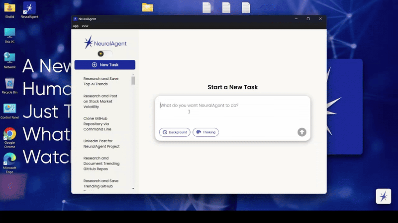

[](https://www.get01agent.com)

**01Agent** is your AI personal assistant that actually *gets things done*. It lives on your desktop, types, clicks, navigates the browser, fills out forms, sends emails, and performs tasks automatically using modern large language models all powered by a fast, extensible, and open architecture. 01Agent uses your computer both in the foreground and the background.

> Real productivity. Not just conversation.

---

[](https://github.com/withneural/01agent/stargazers)

> ⭐️ If 01Agent inspires or helps you, give it a star!

---

In this demo, 01Agent was given the following prompt:

"Find 5 2025 AI trends, write about them on Notepad and save it to my desktop!"

It took care of the rest!



---

## 🌐 Website & Community

- 🌍 **Website**: [https://www.get01agent.com](https://www.get01agent.com)
- 💬 **Discord**: [Join 01Agent Discord](https://discord.gg/eGyW3kPcUs)

---

## 🚀 Features

- ✅ Desktop automation with `pyautogui`
- ✅ Background automation (Windows Only For Now) via WSL (browser-only). Note: The underlying browser automation uses Playwright, which is cross-platform. To enable browser automation on Linux/macOS, ensure Playwright's browser binaries are installed (e.g., `playwright install`).
- ✅ Supports Anthropic, OpenAI, Azure OpenAI, AWS Bedrock, Gemini and Ollama. [Learn more about local LLM setup (Ollama, LM Studio, etc.)](docs/local_llms.md)
- ✅ Modular agents: Planner, Classifier, Suggestor, Title, and more
- ✅ Multimodal (text + vision)
- ✅ FastAPI backend + Electron + React frontend

---

## 🖥️ Project Structure

```
01agent/
├── backend/              # FastAPI + Postgres backend
├── desktop/              # ElectronJS desktop app
│   └── 01agent-app/  # React frontend inside Electron
│   └── aiagent/          # Python code (pyautogui)
└── README.md
```
---

# 🔧 Prerequisites

Before running **01Agent**, make sure the following dependencies are installed on your machine:

| Tool              | Purpose                                           | Recommended Version |
|-------------------|---------------------------------------------------|----------------------|
| 🐍 **Python**       | Required for backend and local AI agent daemon   | `>= 3.9`              |
| 🐘 **PostgreSQL**   | Relational database used by the backend          | `>= 13`               |
| 🟦 **Node.js + npm** | Needed to run the Electron + React frontend      | `Node >= 18`, `npm >= 9` |

---

## 📥 Installation Guides

- **Python**: [https://www.python.org/downloads/](https://www.python.org/downloads/)
- **PostgreSQL**: [https://www.postgresql.org/download/](https://www.postgresql.org/download/)
- **Node.js (includes npm)**: [https://nodejs.org/en/download](https://nodejs.org/en/download)

---

## ⚠️ OS Notes

- 01Agent works on **Windows**, **macOS**, and **Linux**.
- However, **background automation (browser control via WSL)** is **Windows-only** for now.

---

## ⚙️ Setup Instructions

> 🧪 Open **two terminal windows** - one for `backend` and one for `desktop`.

---

### 🐍 Backend Setup

1. **Create and activate a virtual environment (optional but recommended):**

```bash
cd backend
python -m venv venv
# Activate:
source venv/bin/activate  # macOS/Linux
venv\Scripts\activate     # Windows
```

2. **Install requirements:**

```bash
pip install -r requirements.txt
```

3. **Create a local Postgres database. (You have to install Postgres on your computer)**

4. **Copy `.env.example` to `.env` and fill in:**

```env
DB_HOST=
DB_PORT=
DB_DATABASE=
DB_USERNAME=
DB_PASSWORD=

# Not Needed, Just keep empty
DB_CONNECTION_STRING=

JWT_ISS=01AgentBackend
# Generate a Random String for the JWT_SECRET
JWT_SECRET=

# Keep Empty, for now!
REDIS_CONNECTION=

# Optional: For Bedrock
AWS_ACCESS_KEY_ID=
AWS_SECRET_ACCESS_KEY=
BEDROCK_REGION=us-west-2

# Optional: For Azure OpenAI
AZURE_OPENAI_ENDPOINT=
AZURE_OPENAI_API_KEY=
OPENAI_API_VERSION=2024-12-01-preview

# Optional: OpenAI/Anthropic
OPENAI_API_KEY=
ANTHROPIC_API_KEY=

# Optional: For Gemini
GOOGLE_API_KEY=

# Needed if using Ollama, customize if needed
OLLAMA_URL=http://127.0.0.1:11434

# Model config per agent
CLASSIFIER_AGENT_MODEL_TYPE=openai|azure_openai|anthropic|bedrock|ollama|gemini # Select one
CLASSIFIER_AGENT_MODEL_ID=gpt-5

TITLE_AGENT_MODEL_TYPE=openai|azure_openai|anthropic|bedrock|ollama|gemini # Select one
TITLE_AGENT_MODEL_ID=gpt-5-nano

SUGGESTOR_AGENT_MODEL_TYPE=openai|azure_openai|anthropic|bedrock|ollama|gemini # Select one
SUGGESTOR_AGENT_MODEL_ID=gpt-5-mini

PLANNER_AGENT_MODEL_TYPE=openai|azure_openai|anthropic|bedrock|ollama|gemini # Select one
PLANNER_AGENT_MODEL_ID=gpt-5

COMPUTER_USE_AGENT_MODEL_TYPE=openai|azure_openai|anthropic|bedrock|ollama|gemini # Select one
COMPUTER_USE_AGENT_MODEL_ID=us.anthropic.claude-sonnet-4-20250514-v1:0

SUMMARIZER_AGENT_MODEL_TYPE=openai|azure_openai|anthropic|bedrock|ollama|gemini # Select One
SUMMARIZER_AGENT_MODEL_ID=gpt-5-mini

# Internal use only by Neural for optional screenshot logging during training (off by default).
# This is not used by the open-source app or contributors.
ENABLE_SCREENSHOT_LOGGING_FOR_TRAINING=false
AWS_DEFAULT_REGION=us-east-1
AWS_BUCKET=

# For Tracing, Keep false if you don't need langsmith tracing.
LANGCHAIN_TRACING_V2=false
LANGCHAIN_ENDPOINT=
LANGCHAIN_API_KEY=
LANGCHAIN_PROJECT=

# Optional for Google Login
GOOGLE_LOGIN_CLIENT_ID=
GOOGLE_LOGIN_CLIENT_SECRET=
GOOGLE_LOGIN_DESKTOP_REDIRECT_URI=http://127.0.0.1:36478
```

5. **Run database migrations:**

```bash
alembic upgrade head
```

6. **Start the backend server:**

```bash
uvicorn main:app --reload --host 0.0.0.0 --port 8000
```

---

### 🖥️ Frontend (Desktop + Electron) Setup

1. **Install dependencies in the Electron root:**

```bash
cd desktop
npm install
```

2. **Navigate to the React app:**

```bash
cd 01agent-app
npm install
```

3. **Copy `.env.example` to `.env` and fill in:**

```env
REACT_APP_PROTOCOL=http
REACT_APP_WEBSOCKET_PROTOCOL=ws
REACT_APP_DNS=127.0.0.1:8000
REACT_APP_API_KEY=
```

4. **Go back to the desktop root:**

```bash
cd ..
```

5. **Set up the local AI agent daemon (Python service):**
```bash
cd aiagent
python -m venv venv
source venv/bin/activate  # Or use `venv\Scripts\activate` on Windows
pip install -r requirements.txt
deactivate
```

6. **Start the Electron desktop app:**

```bash
cd ..
npm start
```

---

## 🤖 Agents & Model Providers

You can configure different model providers (`OpenAI`, `Azure OpenAI`, `Anthropic`, `Bedrock`, `Ollama`, `Gemini`) per agent in `.env`.  
Agent types include:

- `PLANNER_AGENT`
- `CLASSIFIER_AGENT`
- `TITLE_AGENT`
- `SUGGESTOR_AGENT`
- `COMPUTER_USE_AGENT`
- `SUMMARIZER_AGENT`

---

## 📣 Contributing

We welcome pull requests and community contributions!

---

## 🛡️ License

MIT License.  
Use at your own risk. This tool moves your mouse and types on your behalf, test responsibly!

---

## 💬 Questions?

Feel free to open an issue or start a discussion.
